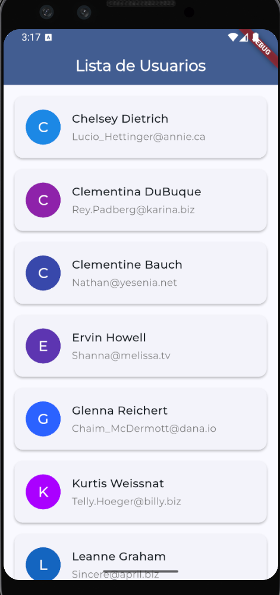
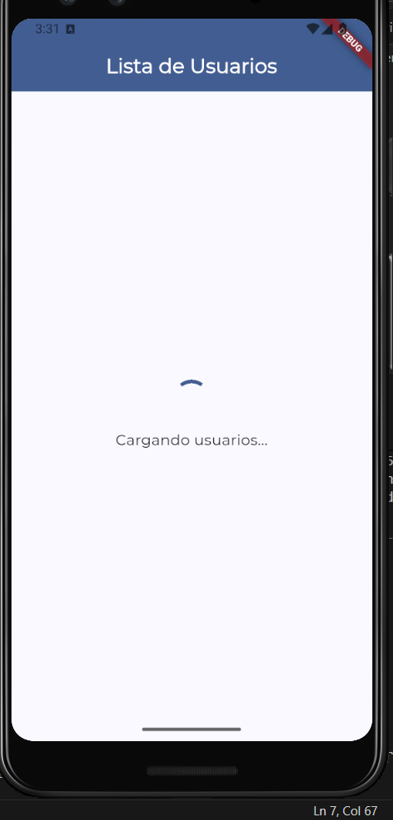
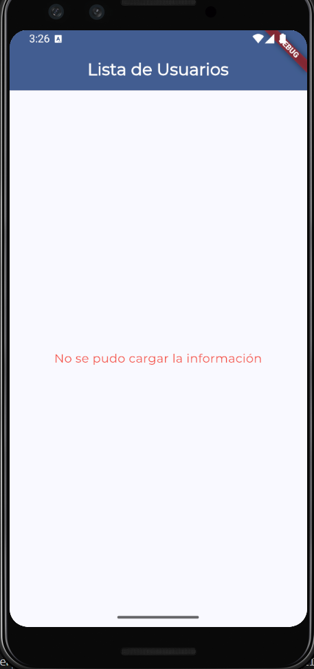

FLUTTER - USERS
===============

English
-------

### Overview
Technical test: single-screen Flutter app that fetches users from https://jsonplaceholder.typicode.com/users, shows name/email in an alphabetically sorted list, includes loading and error states. Built with `http`, `async/await`, and `FutureBuilder`.

### How to run
1) Install dependencies: `flutter pub get`
2) Run on web (fastest): `flutter run -d chrome`
3) Or run on Android emulator/device: `flutter run -d emulator-5556` (replace with your device ID from `flutter devices`).

### What was easiest
- Wiring the `http` client + JSON parsing: the endpoint is simple and mapping to the `User` model was straightforward.

### What was most challenging
- Getting an Android emulator running: existing AVDs were outdated; updating system images, cmdline-tools, and licenses took extra time before the build could install and launch on the emulator.

### Links
- GitHub:  https://github.com/paulabaal12/FLUTTER-USERS

### Screenshots

#### Users List View

#### Loading State

#### Error State

Español
-------

### Descripción
Prueba técnica: app Flutter de una sola pantalla que consume https://jsonplaceholder.typicode.com/users, muestra nombre/correo en una lista ordenada alfabéticamente, maneja estados de carga y error. Usa `http`, `async/await` y `FutureBuilder`.

### Cómo ejecutar
1) Instalar dependencias: `flutter pub get`
2) Ejecutar en web (más rápido): `flutter run -d chrome`
3) O ejecutar en emulador/dispositivo Android: `flutter run -d emulator-5556` (cambia el ID según `flutter devices`).

### Lo más sencillo
- Conectar el cliente `http` y parsear el JSON de jsonplaceholder; ya que el endpoint es simple y el mapeo al modelo `User` fue directo.

### Lo más complejo
- Probar en un emulador Android: los AVD existentes estaban desactualizados; hubo que actualizar imágenes de sistema, cmdline-tools y aceptar licencias antes de que la app instalara y ejecutara en el emulador.

### Enlaces
- GitHub: https://github.com/paulabaal12/FLUTTER-USERS

### Capturas de pantalla

#### Vista de Lista de Usuarios

#### Estado de Carga

#### Estado de Error
